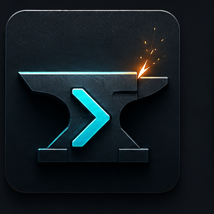

<div align="center" id="readme-top">



![Forge Banner][banner]

[![License][license-badge]][license]
[![Claude Code][claude-badge]][claude-code]
[![Plugin][plugin-badge]][install-url]
[![English][lang-en-badge]][lang-en]
[![简体中文][lang-zh-badge]][lang-zh]

**Router-first instruction templates _plus_ Crucible — a per-machine learning store that teaches your agent from its own past failures.**

Forge generates short `CLAUDE.md` / `AGENTS.md` files that route work across CE / GSD / gstack / Waza / Revolve. **Crucible** sits underneath as Forge's evolution-asset system: a `Stop`-event hook records every tool error into a fingerprinted `failed-directions/` store, and a `PreToolUse` hook blocks future high-risk commands that match a prior failure — returning the proven `correct_action` to the agent _before_ the destructive command runs.

[Quick Start][quick-start] •
[Crucible][crucible-section] •
[Runtime Hooks][runtime-hooks-section] •
[Routing Model][routing-model] •
[Templates][templates] •
[Testing][testing]

</div>

<br>

<details open>
<summary><kbd>Table of Contents</kbd></summary>

- [Why Forge][why-forge]
- [Quick Start][quick-start]
- [Tiers][tiers]
- [Routing Model][routing-model]
- [Templates][templates]
- [Runtime Hooks][runtime-hooks-section]
- [Crucible · Evolution Asset System][crucible-section]
- [Workflow Add-ons][workflow-add-ons]
- [Testing][testing]
- [Repository Layout][repository-layout]
- [Built With][built-with]
- [Acknowledgments][acknowledgments]
- [License][license-section]

</details>

<br>

## Why Forge

AI coding agents are powerful, but their default behavior drifts:

- They over-plan small edits and under-plan risky changes.
- They add dependencies or migrations when a local fix would do.
- They claim tests pass without fresh evidence.
- They treat every workflow tool as if it should own every task.

Forge turns your project instruction file into a **router and guardrail layer**. It tells the agent what to read, what not to introduce, when to escalate, how to verify, and which specialized workflow should handle the job.

The goal is not a giant prompt. The goal is a short instruction surface that an agent can follow under pressure.

Forge also ships **[Crucible][crucible-section]** — a per-machine error-learning store that captures every recurring tool failure into a fingerprinted yaml, and a `PreToolUse` hook that synchronously blocks future high-risk commands matching a known prior failure (returning the proven `correct_action` to the agent before the destructive command runs). Templates, runtime hooks, and Crucible together close the loop: short instructions, enforced guardrails, persistent memory.

## Quick Start

### Claude Code Plugin

```text
/plugin marketplace add https://github.com/eisen0419/forge
/plugin install forge
/forge-setup
```

The setup wizard can generate:

- `CLAUDE.md` for Claude Code
- `AGENTS.md` for Codex
- both files from the same Forge tier

### Manual Install

For Claude Code:

```bash
cp templates/full.md CLAUDE.md
```

For Codex:

```bash
cp templates/targets/codex/full.md AGENTS.md
```

Then replace the `{{VARIABLES}}` placeholders with your project details.

## Tiers

![Forge tiers and routing][tier-diagram]

| Tier | Best for | What it gives you |
|------|----------|-------------------|
| Essential | New repos, smaller projects, first-time agent setup | Context pointers, task routing, forbidden changes, verification, git and safety rules |
| Full | Multi-agent workflows and higher-risk projects | Essential plus CE/GSD/gstack/Waza routing, blast-radius checks, local instruction guidance, hooks/memory guidance, and role mapping |

Both tiers are intentionally compact. Full templates stay under roughly 200 lines.

## Routing Model

Forge does not assume one universal pipeline. It chooses the shortest route that preserves quality.

| Situation | Recommended route |
|-----------|-------------------|
| Tiny fix or one-file change | Standalone Forge rules, CE `/ce-work`, or GSD `/gsd-fast` |
| Feature shaping or product decision | CE strategy/brainstorm/plan, or Waza `/think` for a lean decision-complete plan |
| Existing GSD-managed project | GSD map/new-project/discuss/plan/execute/verify/ship loop |
| CE plan that should be executed by GSD | `/forge-run <plan>` as the CE-plan-to-GSD bridge |
| Product scope, UI quality, browser QA, release confidence | gstack office-hours, autoplan, QA, design review, DX review, or ship gates |
| Focused engineering habit | Waza `/think`, `/hunt`, `/check`, `/health`, `/read`, `/learn`, `/write`, or `/design` |
| Shared API, schema, auth, payments, CI, dependencies | Forge blast-radius check first, then targeted verification |

Waza is a **Focused engineering habit** layer. It is not a GSD-style project state machine or a gstack-style release factory. Use it when the task is narrow: root-cause debugging, diff review, release follow-through, agent health, URL/PDF reading, research, prose, or UI craft.

`/forge-run` is deliberately narrow too. It is only the bridge from an existing CE plan into GSD execution. It should not become the default for every medium or large task.

## Templates

Forge templates are router-first instruction files, not architecture dumps.

| Section | Essential | Full | Purpose |
|---------|-----------|------|---------|
| Context Pointers | Yes | Yes | Point to README, architecture docs, decisions, solutions, and `.planning/` only when needed |
| Task Routing | Yes | Yes | Keep small tasks light and risky tasks structured |
| Do Not Introduce | Yes | Yes | Block unapproved dependencies, package managers, CI, schema, migrations, and secret-bearing state |
| Verification Rules | Yes | Yes | Prevent unsupported "done" claims |
| Coding Standards | Yes | Yes | Soft size/complexity targets with an explicit escape hatch for inherent-size code (state machines, dispatch tables, fixtures) |
| Multi-Agent Router | No | Yes | Choose across Forge, CE, GSD, gstack, Waza, and Revolve |
| Blast Radius | No | Yes | Search callers and dependents before touching shared interfaces |
| Local Instruction Files | No | Yes | Add short local guardrails for auth, payments, infra, migrations, generated SDKs |
| Hooks And Memory | No | Yes | Keep hooks objective; persist `tasks/lessons.md` self-improvement loop; store durable learning in `docs/` |

Recommended local files:

- Root `CLAUDE.md` or `AGENTS.md`: routing, guardrails, verification
- Local `CLAUDE.md` / `AGENTS.md` in sensitive subtrees: local risks and required checks
- `docs/solutions/`: reusable fixes and lessons
- `docs/decisions/`: architecture decisions
- `.planning/`: GSD project state when GSD owns execution

## Runtime Hooks

Templates encode static rules. Hooks encode **runtime behaviour** — actual scripts the agent runtime executes at lifecycle events (`SessionStart`, future others).

Forge ships a manifest-driven hook system:

```bash
# Install one hook (globally into ~/.claude/hooks + ~/.claude/settings.json)
scripts/install-hook.sh project-context

# Install everything in the manifest
scripts/install-hook.sh all

# Uninstall
scripts/uninstall-hook.sh project-context
```

| Hook ID | Event | Language | What it does |
|---------|-------|----------|--------------|
| [`project-context`](./templates/hooks/project-context/) | `SessionStart` | Adaptive (CJK density scan) | Before every first reply, makes the agent emit one line: `Project: <X>. Current stage: <Y>.` using a 4-step fallback chain (README → manifest description → `tasks/todo.md` → recent commits). Override language with `FORGE_HOOK_LANG=zh|en`. |
| [`auto-evolve-collector`](./templates/hooks/auto-evolve-collector/) | `Stop` | English (jsonl/yaml outputs are machine-readable; bilingual correction-keyword scan internally) | On session end, scans the session jsonl for tool errors and user corrections; persists them to a daily raw jsonl, the Crucible failed-directions store, and an **opt-in** Obsidian digest. Sibling to [`templates/crucible/`](./templates/crucible/) and [`scripts/crucible-bookkeep.sh`](./scripts/crucible-bookkeep.sh). |
| [`crucible-preflight`](./templates/hooks/crucible-preflight/) | `PreToolUse` (matcher: `Bash`) | English | Read-side complement to `auto-evolve-collector`. Intercepts high-risk Bash commands (`git push`, `rm -rf`, migrations, `force-push`, etc.) **before** they execute. If a `failed-directions/<fp>.yaml` matches (high-risk regex + ≥ 2 keyword overlap), denies the call and returns the matching `correct_action` as `permissionDecisionReason` to the agent. Anti-false-positive by design; opt-out per fingerprint via `~/.claude/crucible/.acks`; audit trail at `~/.claude/crucible/surface_log.jsonl`. |

The `forge-setup` wizard offers optional hook installation at Step 4.5. See [`templates/hooks/README.md`](./templates/hooks/README.md) for the manifest schema and the three-step recipe for adding your own hook.

## Crucible · Evolution Asset System

> Forge shapes workflows outward. Crucible refines failures inward.

Crucible is an opt-in cross-session learning store, templated at [`templates/crucible/`](./templates/crucible/) and installed at `~/.claude/crucible/`. Two co-located stores let the agent learn from its own failures and successes between sessions:

- `failed-directions/<fingerprint>.yaml` — every recurring error pattern, keyed by a stable 12-char sha1 of `(error_kind, tool_name)`.
- `golden-cases/<gc_id>.yaml` — manually curated success flows, each linked back to the failed direction it prevents.

For L2+ high-risk work (`git push`, migrations, auth, schema changes) the agent reads these before acting, follows the matching `correct_action`, and bumps bookkeeping via [`scripts/crucible-bookkeep.sh hit <fingerprint>`](./scripts/crucible-bookkeep.sh). Population is either manual or automatic via the `auto-evolve-collector` hook (above).

```bash
# Install (idempotent; rerunning refreshes README + schemas, preserves user data)
scripts/install-crucible.sh                  # README + schemas + empty stores + git init
scripts/install-crucible.sh --with-seeds     # also copy the worked-example yamls

# Uninstall (rename, not delete — preserves user-edited correct_action / confidence fields)
scripts/uninstall-crucible.sh
```

The Full-tier templates ship the [`## Pre-Flight Protocol`](./templates/core/sections/18-pre-flight-protocol.md) section that tells the agent **when** to read Crucible (before any L3 high-risk command) and **how** (state extract → grep failed-directions → follow `correct_action` + bookkeep → write golden case). Without that section spliced into your `CLAUDE.md` / `AGENTS.md`, the directory just sits there — see [`docs/workflows/crucible.md`](./docs/workflows/crucible.md) for the wiring.

`forge-setup` (Full tier) offers Crucible install at Step 4.6 + executes at Step 6.6, paired with the `auto-evolve-collector` hook from Step 4.5.

| File | Purpose |
|------|---------|
| [`templates/crucible/README.md`](./templates/crucible/README.md) | Design entry point, data flow, install, cost budget, catchall protocol. Bilingual EN/ZH. |
| [`templates/crucible/schemas/`](./templates/crucible/schemas/) | Authoritative yaml schemas for both record types, annotated by writer. |
| [`templates/crucible/seeds/`](./templates/crucible/seeds/) | Worked example: `df53a88d1096` failed direction ⇄ `gc_example_001` golden case. |
| [`scripts/crucible-bookkeep.sh`](./scripts/crucible-bookkeep.sh) | Four subcommands: `hit`, `list`, `validate`, `gen-fingerprint`. |
| [`scripts/install-crucible.sh`](./scripts/install-crucible.sh) / [`uninstall-crucible.sh`](./scripts/uninstall-crucible.sh) | Wizard-replayable install + rename-safe uninstall. |
| [`templates/core/sections/18-pre-flight-protocol.md`](./templates/core/sections/18-pre-flight-protocol.md) | Canonical agent-facing prose; Full-tier templates already splice this in. |
| [`docs/workflows/crucible.md`](./docs/workflows/crucible.md) | Runtime guide: L0–L3 task routing, the pre-flight protocol, write-back cadence. |

## Workflow Add-ons

Forge works alone, but Full tier can route to these systems when they are installed.

| Add-on | Install for Claude Code | Install for Codex | Best fit |
|--------|-------------------------|-------------------|----------|
| [Compound Engineering][ce-plugin] | `/plugin marketplace add EveryInc/compound-engineering-plugin` then `/plugin install compound-engineering` | `codex plugin marketplace add EveryInc/compound-engineering-plugin`, then `bunx @every-env/compound-plugin install compound-engineering --to codex` | Strategy, ideation, planning, review, product pulse, knowledge compounding |
| [GSD][gsd-repo] | `npx get-shit-done-cc@latest` | `npx get-shit-done-cc@latest` and choose Codex | Durable `.planning/`, codebase mapping, phase execution, verification, shipping |
| [gstack][gstack-repo] | `git clone --single-branch --depth 1 https://github.com/garrytan/gstack.git ~/.claude/skills/gstack && cd ~/.claude/skills/gstack && ./setup` | `git clone --single-branch --depth 1 https://github.com/garrytan/gstack.git ~/gstack && cd ~/gstack && ./setup --host codex` | Product challenge, UI/design/DX review, browser QA, release confidence |
| [Waza][waza-repo] | `npx skills add tw93/Waza -a claude-code -g -y` or `/plugin marketplace add tw93/Waza` then `/plugin install waza@waza` | `npx skills add tw93/Waza -a codex -g -y` | Focused habits: think, hunt, check, health, read, learn, write, design |
| [Revolve][revolve-repo] | `/plugin marketplace add https://github.com/eisen0419/revolve` then `/plugin install revolve` | Use the repo directly as a companion workflow | Research pipeline and instruction evolution |

The Full template explicitly names CE/GSD/gstack/Waza so the agent can pick the right tool instead of stacking all of them.

## Testing

Forge includes a routing-system regression test:

```bash
node scripts/test-forge-routing.mjs
```

The test validates:

- README and README_CN add-on parity
- CE/GSD/gstack/Waza route coverage
- `/forge-run` boundaries
- template size budgets
- plugin metadata
- rendered `CLAUDE.md` and `AGENTS.md` artifacts

The test plan lives at [docs/forge-routing-system-test.md](docs/forge-routing-system-test.md).

## Repository Layout

```text
.
├── templates/
│   ├── essential.md
│   ├── full.md
│   └── targets/codex/
├── skills/
│   ├── forge-setup/
│   └── forge-run/
├── docs/
│   └── forge-routing-system-test.md
├── scripts/
│   └── test-forge-routing.mjs
└── images/
```

## Built With

| Project | Role in Forge |
|---------|---------------|
| [Claude Code][claude-code] | Runtime for `CLAUDE.md` and plugin skills |
| [Codex](https://openai.com/codex/) | Runtime for `AGENTS.md` |
| [Compound Engineering][ce-plugin] | Strategy, planning, review, and knowledge-compounding reference |
| [GSD][gsd-repo] | Durable execution and phase-planning companion |
| [gstack][gstack-repo] | Product, design, DX, browser QA, and release gate companion |
| [Waza][waza-repo] | Focused engineering habit companion |
| [Revolve][revolve-repo] | Research and instruction-evolution companion |

## Acknowledgments

- [Kieran Klaassen](https://github.com/kieranklaassen) and [Every](https://every.to) for [Compound Engineering][ce-plugin]
- [Tw93](https://github.com/tw93) for [Waza][waza-repo]
- [Anthropic](https://anthropic.com) for Claude Code and the `CLAUDE.md` instruction layer
- [Othneil Drew](https://github.com/othneildrew) for [Best-README-Template][readme-template]
- [EverMind AI](https://github.com/EverMind-AI) for README visual inspiration from EverMemOS

## License

[MIT][license]

<!-- Navigation -->
[readme-top]: #readme-top
[why-forge]: #why-forge
[quick-start]: #quick-start
[tiers]: #tiers
[routing-model]: #routing-model
[templates]: #templates
[runtime-hooks-section]: #runtime-hooks
[crucible-section]: #crucible--evolution-asset-system
[workflow-add-ons]: #workflow-add-ons
[testing]: #testing
[repository-layout]: #repository-layout
[built-with]: #built-with
[acknowledgments]: #acknowledgments
[license-section]: #license

<!-- Images -->
[banner]: images/banner-crucible.png
[tier-diagram]: images/tiers.png

<!-- Badges -->
[license-badge]: https://img.shields.io/badge/License-MIT-blue?style=flat-square
[claude-badge]: https://img.shields.io/badge/Claude_Code-Plugin-7C3AED?style=flat-square
[plugin-badge]: https://img.shields.io/badge/Install-Plugin-F97316?style=flat-square
[lang-en-badge]: https://img.shields.io/badge/English-lightgrey?style=flat-square
[lang-zh-badge]: https://img.shields.io/badge/简体中文-lightgrey?style=flat-square

<!-- Links -->
[license]: LICENSE
[claude-code]: https://claude.ai/code
[install-url]: https://github.com/eisen0419/forge
[lang-en]: README.md
[lang-zh]: README_CN.md
[ce-plugin]: https://github.com/EveryInc/compound-engineering-plugin
[gsd-repo]: https://github.com/gsd-build/get-shit-done
[gstack-repo]: https://github.com/garrytan/gstack
[waza-repo]: https://github.com/tw93/Waza
[revolve-repo]: https://github.com/eisen0419/revolve
[readme-template]: https://github.com/othneildrew/Best-README-Template
